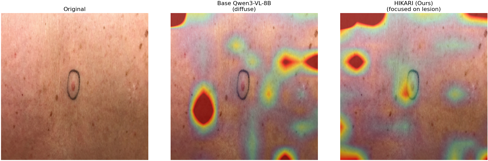
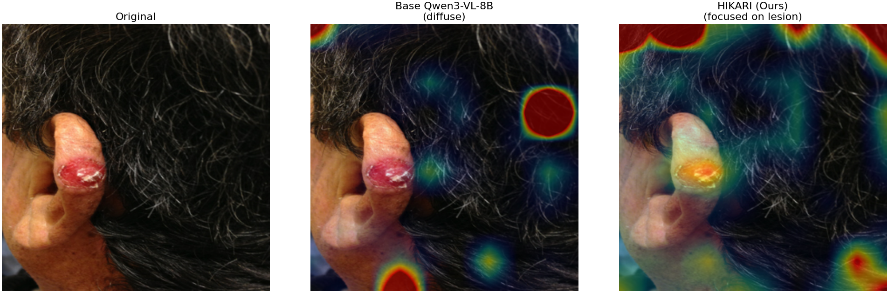

<div align="center">


<br/>

[](.)
[](https://huggingface.co/Qwen/Qwen3-VL-8B-Thinking)
[](https://huggingface.co/datasets/joshuachou/SkinCAP)
[](.)
[](./Conference_Paper.tex)
[](.)

<br/>

> **HIKARI** — A RAG-in-Training pipeline for fine-grained skin lesion diagnosis
> using Qwen3-VL-8B-Thinking × SkinCAP × Hybrid Retrieval-Augmented Generation

</div>

---

## ✨ Highlights

<table>
<tr>
<td width="50%">

### 🏆 Key Results
| Model | Acc |
|-------|-----|
| 🥇 **HIKARI (RAG-in-Training)** | **85.86%** |
| 🥈 Cascaded FT + Inference RAG | 79.80% |
| 🥉 Single-Image Fine-Tune | 74.00% |
| Zero-Shot Frontier (best) | 50.51% |
| Base Qwen3-VL-8B (no FT) | 33.33% |

</td>
<td width="50%">

### 🔬 5 Diseases at 100% Sensitivity
```
✅ Psoriasis          100% (13/13)
✅ Melanocytic Nevi   100% (12/12)
✅ SCCIS              100% (12/12)
✅ Basal Cell Ca.     100% (13/13)
✅ Acne Vulgaris      100%  (8/8)
```

</td>
</tr>
</table>

---

## 📐 Architecture

```
┌─────────────────────────────────────────────────────────────────────┐
│                         HIKARI Pipeline                             │
├─────────────────────────────────────────────────────────────────────┤
│                                                                     │
│   Qwen3-VL-8B (Base)                                                │
│         │                                                           │
│         ▼  Stage 1 — Group Classifier (4 groups, 88.68%)           │
│   ┌──────────────┐      weights ──────────────────────────┐        │
│   │ Group Clf.   │                                         │        │
│   └──────────────┘                                         │        │
│         │                                                   ▼       │
│         ▼  Stage 2 — Disease Classifier (10 classes)               │
│   ┌──────────────────────────────────────┐                         │
│   │  [ref_img] Reference 1: psoriasis    │  ← RAG-in-Training      │
│   │  Description: Erythematous plaques…  │    K=1 ref per sample   │
│   │  [query_img] What skin disease?      │    R2 encoder (α=0.9)   │
│   └──────────────────────────────────────┘                         │
│         │                                                           │
│         ▼  Stage 3 — Caption Generator (BLEU-4: 29.33)             │
│   ┌──────────────┐  Merged-Init  ┌──────────────────────────┐      │
│   │ Disease Clf. │ ────────────▶ │ Caption Model            │      │
│   │  (frozen)    │               │ (fresh LoRA adapters)    │      │
│   └──────────────┘               └──────────────────────────┘      │
│                                                                     │
│   ──────────────── Inference ─────────────────────────────────     │
│   RAG Index (911 train imgs) → CLIP R0 retrieval → K=3 refs        │
│   → Prompt → Qwen3-VL-8B → Disease Name                            │
└─────────────────────────────────────────────────────────────────────┘
```

---

## 📊 Attention Map Visualization

<div align="center">

*LM Prefill Attention — last input token → image patch positions*

| Melanocytic Nevi | Basal Cell Carcinoma |
|:----------------:|:--------------------:|
|  |  |
| Network & border focus | Nodular lesion annotation |

> **Left:** Base Qwen3-VL-8B (unfocused) → **Right:** HIKARI (disease-specific focus)

</div>

---

## 🗂️ Project Structure

```
HIKARI/Model/
│
├── 🚀 Training
│   ├── train_two_stage_FuzzyTopK.py   # Main training: Single-Image FT + RAG-in-Training
│   ├── train_three_stage_hybrid_topk.py # M-series 3-stage pipeline
│   ├── train_qwen3_caption.py          # Stage 3 caption training
│   └── run_stage3_experiments.py       # Stage 3 ablation (Way1/2 × STS)
│
├── 🔍 Inference & Evaluation
│   ├── inference_disease_classification.py  # Main eval script (all models × RAG × prompts)
│   ├── run_rag_benchmark.py                 # Full RAG benchmark runner
│   └── rag_retrieval.py                     # HybridRAGRetriever (R0–R4 encoders)
│
├── 📈 Analysis & Visualization
│   ├── gradcam_visualization.py     # LM Prefill Attention maps
│   ├── analyze_benchmark.py         # Result analysis
│   ├── plot_confusion_matrix.py     # Confusion matrix plots
│   └── gradcam_outputs/             # Attention comparison images
│
├── 📄 Paper & Docs
│   ├── Conference_Paper.tex         # ITC-CSCC 2025 paper
│   ├── summary.md                   # Full project summary (EN)
│   ├── summary_Th.md                # Full project summary (TH) + experiment definitions
│   └── plan.md                      # Development roadmap
│
├── 💾 Data Splits
│   ├── split_info_3stage.json       # Locked 911/99 stratified split
│   ├── split_info_fuzzytopk.json    # Standalone fuzzytopk split
│   └── val_captions_for_symptoms.json  # 94 patient symptom descriptions
│
└── ⚙️ Config
    └── requirements.txt
```

---

## 🧪 Experiments at a Glance

<div align="center">

| Model | Paper Name | RAG Train | RAG Infer | Acc |
|-------|-----------|:---------:|:---------:|:---:|
| `fuzzytopk` | Single-Image FT | — | — | 74.00% |
| `M1` | 2-Stage Cascade FT | — | R0 | 59.38% |
| `fuzzytopk_s1cascade` | Cascaded FT (α=0.9) | — | R2 | 79.80% |
| `fuzzytopk_s1cascade` | Cascaded FT (α=0.5) | — | R2 | 74.75% |
| **`fuzzytopk_s1cascade_ragR2_a09`** | **RAG-in-Training (Ours)** | **R2 K=1** | **R0** | **85.86%** |

</div>

### RAG Encoder Configurations (R0–R4)

| ID | Image Encoder | Text Encoder | Best Use |
|----|--------------|--------------|----------|
| **R0** | `openai/clip-vit-base-patch32` | — | ✅ Best at **inference** for HIKARI |
| **R1** | CLIP | `medicalai/ClinicalBERT` | Generic clinical text |
| **R2** | `google/siglip-2-base-patch16-512` | `BAAI/bge-m3` | ✅ Used during **training** |
| **R3** | `jinaai/jina-clip-v2` | `ncbi/MedCPT-Query-Encoder` | Best with α=0.7 |
| **R4** | `nomic-ai/nomic-embed-vision-v1.5` | `nomic-ai/nomic-embed-text-v1.5` | Cross-modal unified |

---

## 🚀 Quick Start

### 1. Install

```bash
git clone https://github.com/E27-25/HIKARI.git
cd HIKARI/Model
pip install -r requirements.txt
huggingface-cli login
```

### 2. Train — RAG-in-Training (HIKARI)

```bash
# Stage 1: Group classifier (run once, shared across models)
# Stage 2: RAG-in-Training (main contribution)
python train_two_stage_FuzzyTopK.py \
    --start_from_stage1 \
    --rag_k_train 1 \
    --rag_exp R2 \
    --alpha 0.9

# Stage 3: Caption generation (Merged-Init)
python train_two_stage_FuzzyTopK.py \
    --stage3_init merged \
    --use_sts False
```

### 3. Evaluate

```bash
# Full RAG benchmark (all models × encoders × prompts)
python run_rag_benchmark.py \
    --method fuzzytopk_s1cascade_ragR2_a09 \
    --rag_exp R0

# Single inference
python inference_disease_classification.py \
    --stage2_method fuzzytopk_s1cascade_ragR2_a09 \
    --rag_exp R0
```

### 4. Attention Visualization

```bash
python gradcam_visualization.py  # Generates comparison images in gradcam_outputs/
```

---

## 🔑 Key Findings

<table>
<tr><td>

**💡 RAG-in-Training closes the train/inference gap**
Training with K=1 reference image per sample teaches the model to use retrieval context — no architectural changes needed.

</td></tr>
<tr><td>

**💡 Encoder-agnostic generalization**
HIKARI trained with SigLIP+BGE-M3 (R2) but performs best with CLIP (R0) at inference (+3.03 pp) — the model learns the *concept* of reference-guided diagnosis, not encoder-specific features.

</td></tr>
<tr><td>

**💡 Merged-Init prevents catastrophic interference**
Merging LoRA into base weights before Stage 3 → BLEU-4: 9.82 → **29.33 (3×)**. Never fine-tune existing adapters on a different task.

</td></tr>
<tr><td>

**💡 Group cascade hurts more than it helps**
3-stage M-series (M1 oracle: 66%) still underperforms simple 2-stage fuzzytopk (74%) — cascade penalty from mismatched weight initialization outweighs group context benefit.

</td></tr>
</table>

---

## 📋 Per-Disease Results (HIKARI Best Config: R0-P0)

<div align="center">

| Disease | Sensitivity | n | PPV |
|---------|:-----------:|:---:|:---:|
| 🟢 Psoriasis | **100.0%** | 13 | 92.9% |
| 🟢 Melanocytic Nevi | **100.0%** | 12 | 100.0% |
| 🟢 SCCIS | **100.0%** | 12 | 100.0% |
| 🟢 Basal Cell Carcinoma | **100.0%** | 13 | 100.0% |
| 🟢 Acne Vulgaris | **100.0%** | 8 | 88.9% |
| 🟡 Lichen Planus | 88.9% | 9 | 88.9% |
| 🟡 Scleroderma | 87.5% | 8 | 77.8% |
| 🟡 Photodermatoses | 75.0% | 8 | 66.7% |
| 🔴 Lupus Erythematosus | 55.6% | 9 | 55.6% |
| 🔴 Sarcoidosis | 14.3% | 7 | 33.3% |

*🔴 Sarcoidosis collapse is a known limitation — over-reliance on reference agreement during training*

</div>

---

## ⚙️ Hardware & Training Config

| Parameter | Value |
|-----------|-------|
| Backbone | Qwen3-VL-8B-Thinking |
| Quantization | 4-bit NF4 (Unsloth) |
| LoRA rank / alpha | 16 / 32 |
| Effective batch size | 8 (2×GPU + grad_accum=4) |
| Optimizer | AdamW 8-bit paged |
| GPU | NVIDIA RTX 5070 Ti (15.92 GB VRAM) |
| Training time | ~1h 44min (1,314 steps) |
| Image size | 672×672 thumbnail (LANCZOS) |

---

## 📄 Citation

If you use HIKARI in your research, please cite:

```bibtex
@inproceedings{hikari2025,
  title     = {HIKARI: RAG-in-Training for Fine-Grained Skin Lesion Diagnosis
               with Vision-Language Models},
  booktitle = {Proceedings of ITC-CSCC 2025},
  year      = {2025}
}
```

---

## 📚 References

- [Unsloth](https://github.com/unslothai/unsloth) — Efficient LLM fine-tuning
- [Qwen3-VL](https://huggingface.co/Qwen/Qwen3-VL-8B-Thinking) — Vision-Language backbone
- [SkinCAP Dataset](https://huggingface.co/datasets/joshuachou/SkinCAP) — 4,000 dermatology images
- [BGE-M3](https://huggingface.co/BAAI/bge-m3) — Multilingual text embeddings
- [SigLIP-2](https://huggingface.co/google/siglip-2-base-patch16-512) — Image encoder

---

<div align="center">


</div>
